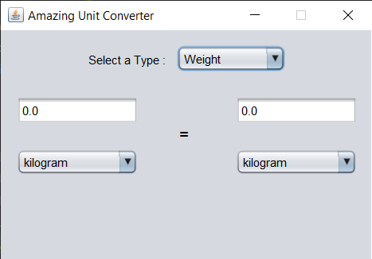

# Unit Conversion Project

This Java-based project allows users to convert three types of units: weight, length, and capacity. The conversion spans various scales from kilo to milli. The user can input values and see the converted result in the desired units.

## Features
- Convert weight (e.g., kilograms to milligrams)
- Convert length (e.g., meters to millimeters)
- Convert capacity (e.g., liters to milliliters)
- User-friendly interface for easy conversions

## Requirements
- Java 8 or higher
- Any Java IDE (Eclipse, IntelliJ, etc.)

## How to Run
1. Clone the repository or download the project.
2. Open the project in your preferred Java IDE.
3. Compile and run the main class.

## Screenshots
Here are some screenshots of the project in action:

## Usage
1. Choose the type of conversion you need: weight, length, or capacity.
2. Enter the value you want to convert.
3. Select the desired units (from kilo to milli).
4. The result will be displayed instantly.

## Contributing
Feel free to fork the repository and submit pull requests with improvements or fixes!
